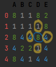
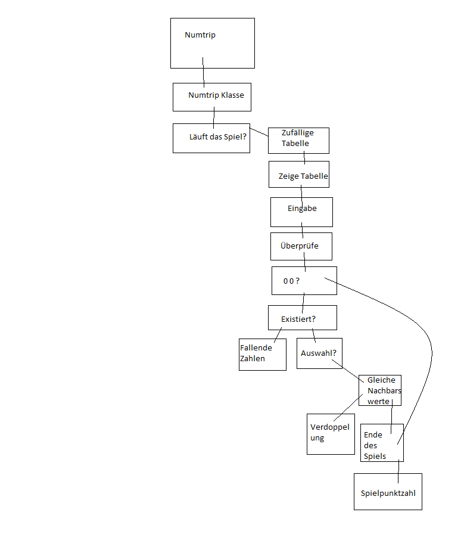

***
Heute ist die Abgabe vom Numtrip. Und ich, ich habe alles programmiert, was gebraucht wird, um dann das Spiel spielbar zu machen.\
Ich möchte noch meine Erkenntnisse und eine Zusammenfassung des Numtrips verfassen, bevor ich alles abgebe. Auch damit die Person, die Numtrip programmieren möchte eine Idee hat, welche Probleme auftretten können und was diese Person besser als ich tun könnte, dennoch welche Nach- und Vorteile das einem bringt. 
### Ziel des Spiels
Das Ziel des Spiels ist die **grösste Zahl** zu kriegen (in meinem Programm über 256 bzw. 512) mit den möglichst **wenigen Spielzügen**. \
Man darf **kein Wert** wählen, das **nicht in der Nachbarszellen** steht (siehe das erste Bild) sonst verliert man!

> 
>
> Die **blau**-eingekreiste Zahl: **ausgewählte Zahl**
> 
> Die **gelb**-eingekreisten Zahlen: **Nachbarszahlen**
### Top Down Entwurf
Top Down Entwurf von Numtrip (bitte nicht kritisieren! Weder hatte ich Zeit noch die richtigen Werkzeuge...).
> 

### Voraussetzung
- Python-Version: **Python 3.x** und probiert mit Python 3.10.6
- Ein Computer ;P

### Meine Erkenntnisse
Python hatten wir in der Schule schon gehabt, jedoch mit einer Bibliothek (Tigerjyton).
Diese war einfach zu steuern und war gut für Anfänger, welche noch nie programmiert haben. Doch für jemanden, der sich in der Informatik vertiefen will ist das ein Nichts-Nutz...\
Man muss Neues dazu lernen, wenn man **ECHTES** Python macht, wzB. die Schleifen, es gibt keine Grafiken, Python ist keine "Zeichnungsprache", usw. \
Für mich war das wort wörtlich vergeudete Zeit mit Tigerjyton... Ich lernte etwas, was für meine Karriere keine Auswirkungen haben würde. \
Deshalb war es auch schwieriger für mich in Python einzusteigen, obschon ich auf JavaScript programmieren konnte.\
Numtrip, ein vom Augen her simples Spiel, war das eine relevante Übung, das mir ermöglicht hat Python und das Programmieren besser zu beherrschen, und zwar nicht wenig (trotzdem bin ich noch kein Meister).\
Das war eine profitable Aufgabe, welche ich jeden empfehlen kann, es ist nicht leicht, doch das lohnt sich wenn man Anfänger ist (wird aufwändiger sein, aber gleichzeitig hilfreich sein) und schon mit Pyhton oder anderen Sprachen programmiert hat (für Fortgeschrittene eher nicht).\
Bei mir hat es an Zeit vollkommend gereicht das Spiel zu enden, trotz der vielen Schwierigkeiten, die auftratten.\
Nachteile gibt es für mich keine.
### Tipps
Was mein Blogleser besser tun könnte als ich, ist **sich die Zeit** nehmen alles korrekt zu **verstehen** und wenn das einem unverständlich ist, Beispiele  und/oder Definitionen irgendwo **aufschreiben**, wo er das wieder hervornehmen kann, falls Fragen auftauchen.

### Zusammenfassung
Man soll lieber Programmiersprachen **ohne Bibliotheken** lernen, vorallem wenn diese nicht im Geschäftlichen genutzt wird, erstens. \
Zweitens, **Numtrip ist sehr lehrreich**, doch ist aufwändig.\
Und als Letztes sich alles zu **notieren**, was für einem neu gewesen ist, diese dann brauchen und Beispiele machen. \
Vielen Dank, falls du bis dahin gelesen hast! \
Wünsche dir viel Erfolg beim Programmieren!

Hier ist noch den Link zum Spiel:
https://github.com/mcdelarosa/EF-Informatik/blob/main/numtrip/game.py