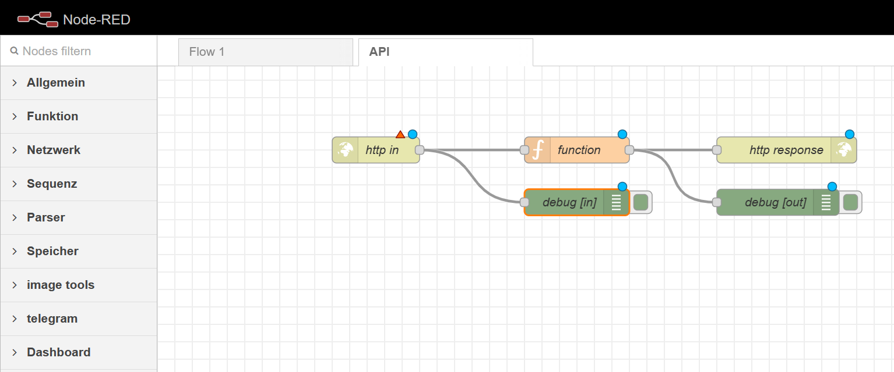
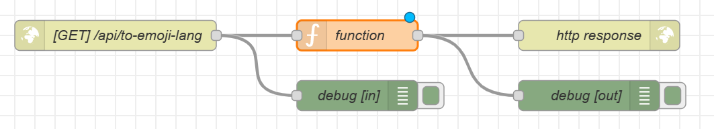

Um einen "einfachen" API herzustellen, haben wir Node-RED gebraucht.

Anleitung:
---
 **Vorkenntnissen von API gebraucht!!!!**  
So sollten alle, die gebrauchten Kästchen, aussehen (Verbindungen noch gebraucht und ganz normale Debug-Kästchen):

'http in' zu GET-Methode ändern (um Neues hinzufügen zu können) und diese URL einfügen `/api/to-emoji-lang`.

Was **nicht** zu ändern **genannt** wurde, ist auch **nicht** zu **ändern** gebraucht!
Nun beginnt das Lustige!  
Ändere die Funktion mit dem was du kriegen möchtest, ich zB:
  
```
let emoji = msg.payload.text.toLowerCase();

const icons = [
['hello', '👋'],
['melone','🍈'],
['hallo', '👋']

]

icons.forEach(function(element) {
emoji = emoji.replace(element[0], element[1])    
});


msg.payload = {
msg: emoji
};

return msg;
```
Das ändert den Text so, dass die Wörter in der Array zu den nächsten Emojis ersetzt werden.

Erfahrungen:
---
Meine Erfahrungen bis dahin sind nicht wirklich begeisternd...  
Ich finde es gut, dass man eine **Software** hat für **"Nicht-Entwickler"**, denn eigentlich braucht man kaum zu programmieren, und vieles ist vereinfacht bzw: die Konvertierung des Codes in irgendeine andere Sprache.  
Doch ich habe **anfangs**,und es kann wahrscheinlich an mir liegen, nicht viel gelernt...  
Nachdem ich mir die Zeit genommen hatte etwas zu verstehen, wie das Node-RED funktionieren könnte, war mir alles verständlicher geworden.  
Mir wäre es aber lieber, wenn wir das **Programmieren** könnten, anstatt diese App zu brauchen, mit der Gedanke, dass dies auch **herausfordender** wäre.  
Schliesslich würde ich mehr **verstehen** und alles besser **geniessen**, glaube ich.


Cookies:
---
Cookies sind vom **Server** gespeicherte **Daten**, die vom **Nutzer** abhängig sind, bzw. bei jeder sind andere Daten gespeichert, also **personalisierte** Daten (können aber ähnlich sein).   
Werden in **Webseiten** gebraucht und prüfen auch die **Gültigkeit**.  
Diese sind praktisch, weil man die Daten nicht **neunachfragen/-generieren** muss.  
Im **Login** ist es so, dass der Server den Nutzer durch Cookies **erkennt**, und dient bei uns dazu, dass er keine neue **Account** erstellt werden kann und auch zbsp. das Passwort und der Benutzername werden gespeichert.  
Doch es ist auch **nicht sicher**. Denn alles wird im Computer des Klientes **gespeichert** und kann auch direkt vom Computer **geändert** werden, also kann die Website **gehackt** werden.
Und bei uns sind diese Daten auch in einem Dokument gespeichert, welches **nicht verschlüsselt** wurde.
