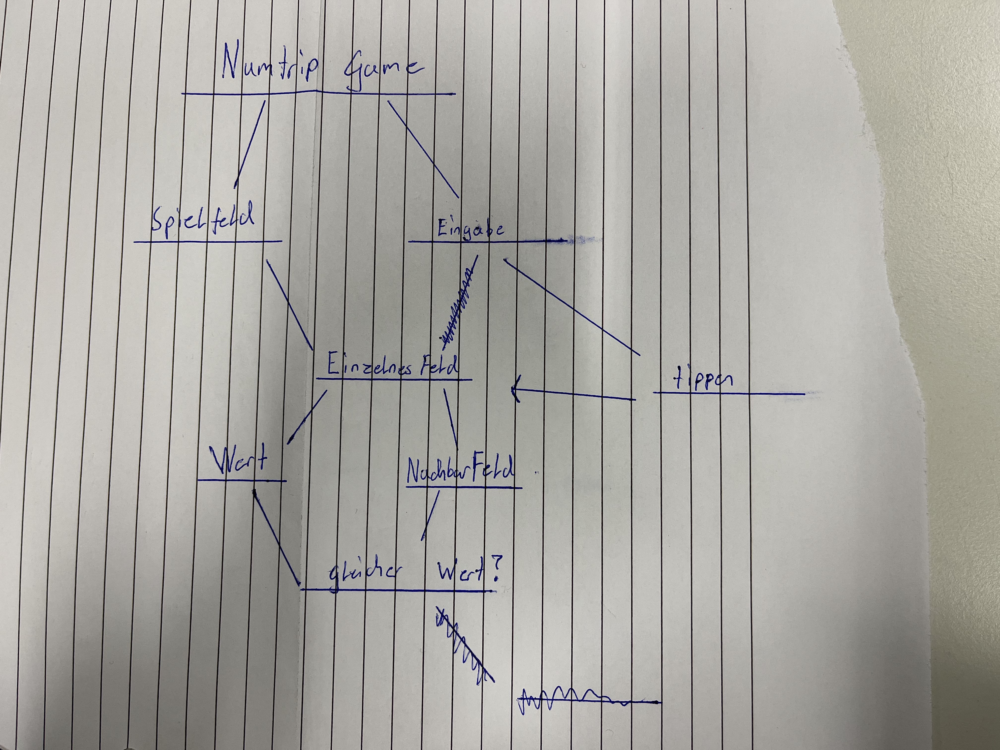

Das waren meine Entwürfe (auch mit Kollegen) des Numtrips, um eine Idee zu haben was gerade gemacht wurde oder noch zu tun ist.
### Unser allererster Entwurf:

- wir wollten nur herausfinden (überlegen) wie das Numtrip aussehen sollte
  - Mit Zahlen sollte dies arbeiten
  - Felder die Zahlen enthalten
  - Könnte man als 2D-Matrix darstellen (was wiederum aus Listen besteht)

### Unser letzter Entwurf:

Einleitung:
1. Das Programm soll das Numtrip Spiel erstellen
2. Spielfeld und Eingabe:
   - Spielfeld soll erstellt und gezeichnet werden
   - Der Spieler sollte Koordinaten (ein Feld) auswählen können.
3. Getipptes einzelnes Feld:
   - Man soll dieses Feld überprüfen und nach gleichen Werte suchen (die in der Nähe stehen).

Der Rest wurde vernachlässigt, weil das für uns an dieser Zeit unwichtig.
